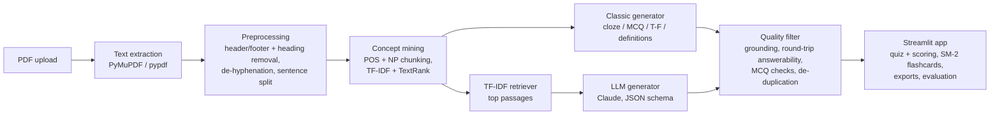
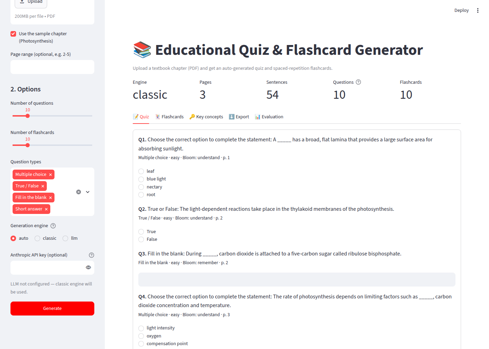
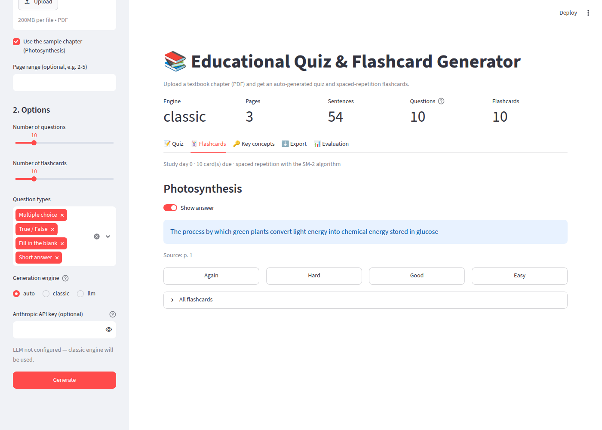
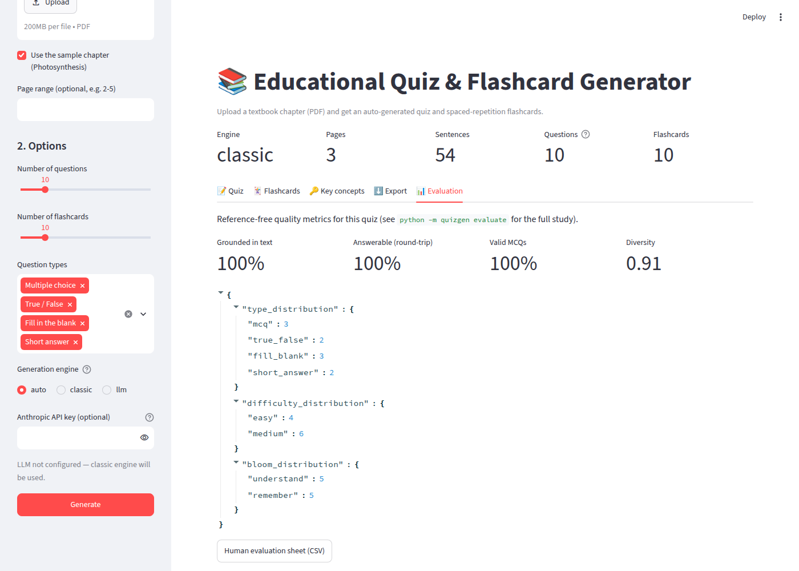

# Educational Quiz & Flashcard Generator from PDF Textbooks

NLP mini-project (LAB CA, Task 2) for the Natural Language Processing course (216U01E745), Sem VII, B.Tech Computer Engineering, K. J. Somaiya School of Engineering, 2026–27.

Upload a textbook chapter as a PDF and the app generates:

- **A quiz** with multiple-choice, true/false, fill-in-the-blank and short-answer questions. Each question has an answer key, an explanation and the source page.
- **Flashcards** with SM-2 spaced repetition (the scheduling algorithm Anki uses).
- **Exports**: a printable PDF worksheet, Markdown, CSV, JSON and an Anki deck (`.apkg`).

There are two generation engines:

| Engine | How it works | Needs |
|---|---|---|
| **classic** (default) | NLP pipeline: tokenization, POS tagging, noun-phrase chunking, TF-IDF + TextRank keyphrases, definition patterns, cloze generation, WordNet and context-similarity distractors | nothing (runs offline) |
| **llm** (optional) | Retrieval-augmented generation with Claude. TF-IDF retrieval picks the key passages, the model returns schema-constrained JSON, and every item must quote its source sentence, which is checked against the PDF | an Anthropic API key |

## Quick start

```bash
python -m venv .venv && source .venv/bin/activate   # Windows: .venv\Scripts\activate
pip install -r requirements.txt
python -c "from quizgen.nlp import ensure_nltk_data; ensure_nltk_data()"   # one-time NLTK download

streamlit run app.py          # web app at http://localhost:8501
```

Command line:

```bash
python -m quizgen generate data/sample_textbook.pdf -n 10 -f 10 --out outputs
python -m quizgen generate mybook.pdf --pages 12-18 --types mcq,true_false --engine classic
python -m quizgen evaluate data/sample_textbook.pdf --refs data/reference_questions.json --out docs/evaluation_results.json
python -m pytest              # 21 tests
```

To use the LLM engine, set `ANTHROPIC_API_KEY` or paste a key into the app's sidebar. A key typed into the app is used only for that session. If no key is set, or an API call fails, the app falls back to the classic engine and shows a warning.

## Architecture



| Module | Responsibility | NLP concepts used |
|---|---|---|
| `quizgen/pdf_extract.py` | page-wise text extraction | – |
| `quizgen/preprocess.py` | cleaning, heading/header/footer removal, sentence segmentation, chunking | text normalization, sentence segmentation |
| `quizgen/nlp.py` | tokenization, POS tagging, regexp NP chunker, lemmatization, WordNet | tokenization, POS tagging, shallow parsing, lemmatization |
| `quizgen/keywords.py` | keyphrase extraction and ranking | TF-IDF, TextRank (PageRank on a co-occurrence graph) |
| `quizgen/distractors.py` | wrong options for MCQs | vector-space similarity, WordNet hypernyms and co-hyponyms |
| `quizgen/classic.py` | question and flashcard templates, definition patterns | rule-based information extraction |
| `quizgen/retrieval.py` | TF-IDF retriever | information retrieval, RAG |
| `quizgen/llm.py` | grounded LLM generation (optional) | LLMs, prompt engineering, structured output |
| `quizgen/quality.py` | grounding, answerability round-trip, de-duplication | QA-style verification, Jaccard similarity |
| `quizgen/evaluate.py`, `baseline.py` | BLEU, ROUGE-L, coverage, intrinsic metrics, naive baseline | evaluation of generated text |
| `quizgen/srs.py` | SM-2 spaced repetition | – |
| `quizgen/export.py` | PDF, Markdown, CSV, JSON, Anki | – |
| `app.py` | Streamlit UI | – |

## Results on the sample chapter (15 questions)

Generated by `python -m quizgen evaluate` (full output in [`docs/evaluation_results.json`](docs/evaluation_results.json)):

| System | ROUGE-L ↑ | BLEU-4 ↑ | Ref. concept coverage ↑ | Answer is key concept ↑ | Distractor is key concept ↑ | Diversity ↑ |
|---|---|---|---|---|---|---|
| Naive cloze baseline | 0.418 | 0.105 | 34.6% | 26.7% | 8.3% | 0.825 |
| Classic NLP (full pipeline) | **0.516** | **0.129** | **80.8%** | **100%** | **50.0%** | **0.906** |

For the classic pipeline, 100% of questions were grounded in the text, 100% passed the answerability check, and 100% of MCQs were valid. See [`docs/REPORT.md`](docs/REPORT.md) for the methodology, the quality-filter ablation (it rejects nothing from the classic engine on this chapter; it exists to catch LLM hallucinations) and the limitations. The LLM engine adds a row to this table automatically when an API key is set.

## Screenshots

| Quiz | Flashcards | Evaluation |
|---|---|---|
|  |  |  |

## Repository layout

```
app.py                     Streamlit app
quizgen/                   library + CLI (python -m quizgen)
tests/                     pytest suite
data/sample_textbook.pdf   demo chapter (original text, built by scripts/make_sample_pdf.py)
data/reference_questions.json  teacher-written reference questions for evaluation
docs/REPORT.md             project report
docs/PRESENTATION.md       slide-by-slide presentation outline + demo script
docs/evaluation_results.json, docs/screenshots/
```
